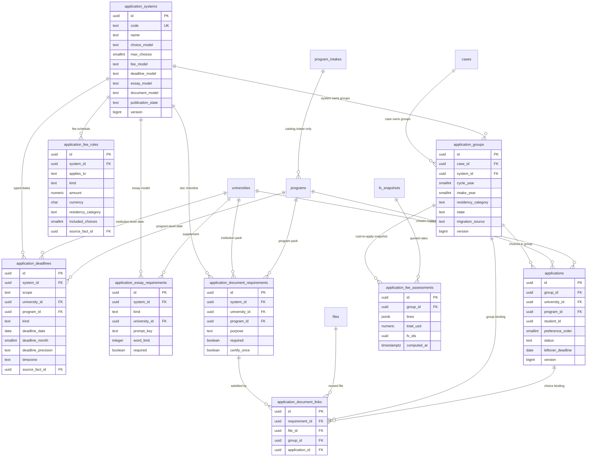

# Application systems ER (owner §6)

**Status:** approved 24 Sep 2026. Schema + lossless backfill ship in `0032_application_systems.sql`. Still no APP / Prompt 9 screens. Owner answers to §5 are binding.

**Authority:** `SCOPE-ALIGNMENT.md` §6 is an owner addition. It is not in the Complete Development Specification. Spec CAT-01–CAT-06, Module 7, and “Catalog, matching, and financial snapshots” still govern catalog, shortlist, costs, and assessments. Where this note and the spec disagree on catalog/shortlist/cost rules, the spec wins. Where they disagree on *how a student applies through a platform*, §6 wins.

**Not this model:** `saved_options` (CAT-06, 0–3 university+program pairs) is planning, not an application. Recommendations (≤10) are not saved slots and not applications. Parked Essays (`essays` leftover, ESS-01–07) are not extended here; only the *essay model* a system requires is named. Leftover `documents` folds into spec `files` / STU-07 later; this note only says how a requirement points at a file.

---

## 1. Proposed ER

An **application** is one *choice* (course, campus, or school) inside an **application group**. A group belongs to one **application system**. The system owns fee rules, deadline types, essay model, and document requirements. Institution-level deadlines, supplements, and extra fees hang off the same system but target a university or program.

`program_intakes` stays the Module 7 catalog fact (intake + program deadline precision for CAT-03). It is **not** an application-system deadline. A later command may *copy* a sourced fact into `application_deadlines` with `scope = program`; it must not treat every catalog intake date as “the UCAS deadline.”

### Proposed constraints (commands, not UI)

| Rule | Enforcement |
| --- | --- |
| Application belongs to exactly one group; group belongs to exactly one system | FKs |
| `choice_model = preference_ordered` | `preference_order` NOT NULL, `UNIQUE(group_id, preference_order)` |
| `choice_model = unordered_set` or `single` | `preference_order` NULL |
| `max_choices` | command lock on the group; reject above cap |
| `essay_model` | templates only; no ESS screen work |
| `document_model` + `certify_once` | one clean `files` row can satisfy many links |
| Fee / deadline amounts and dates | `source_fact_id` when published; unknown stays unknown |
| Privileged writes | command + audit + outbox, same transaction as the rest of the app |

Proposed enums (owner may rename):

- `choice_model`: `single` \| `unordered_set` \| `preference_ordered`
- `fee_model`: `per_system` \| `per_choice` \| `per_group` \| `hybrid`
- `deadline_model`: `system` \| `institution` \| `both`
- `essay_model`: `one_statement_many_courses` \| `shared_core_plus_supplements` \| `per_choice` \| `system_prompts` \| `none`
- `document_model`: `system_certification` \| `per_institution` \| `both`
- `application_deadlines.scope`: `system` \| `institution` \| `program`
- `application_fee_rules.applies_to`: `system` \| `group` \| `choice`
- `application_essay_requirements.kind`: `shared_core` \| `supplement` \| `one_statement`

`direct` (or equivalent) is a system for an institution that is not on a named platform. `legacy_unmapped` is a **SYNTHETIC** seed used only to migrate leftover rows without guessing UCAS vs Common App.

---

## 2. How each platform maps

One `application_systems` row per *platform the student files on*, not per university. Codes below are proposal labels.

| System | `choice_model` | `max_choices` | `fee_model` | `deadline_model` | `essay_model` | `document_model` | Group / choice meaning |
| --- | --- | --- | --- | --- | --- | --- | --- |
| **UCAS** | `unordered_set` | 5 | `per_system` (one fee covers the set) | `system` (equal-consideration + extras as kinds) | `one_statement_many_courses` | `per_institution` for course-specific packs; no central certifier | One group = one UCAS apply. Each `applications` row is a course. One statement requirement on the group, not five essays. |
| **Common App** | `unordered_set` | platform cap (sourced) | `hybrid` (base + per-school) | `both` (app close vs school deadline) | `shared_core_plus_supplements` | `both` | One group = one Common App cycle. Each choice is a member school. Supplement rows keyed by `university_id`. |
| **Coalition** | same shape as Common App | sourced | `hybrid` | `both` | `shared_core_plus_supplements` | `both` | **Separate system row** (different rails). Same pattern, not the same group. |
| **UC** | `unordered_set` of campuses | all UC campuses that cycle | `per_system` | `system` | `system_prompts` (one UC app) | `system_certification` plus campus extras | One group spans campuses. Outcomes may still differ per campus (`applications.status`). |
| **Cal State** | `unordered_set` | sourced | `per_system` | `system` | `system_prompts` | `both` | **Separate system** from UC (different application). |
| **OUAC** | `unordered_set` | sourced | `hybrid` (base + program choices) | `both` | `per_choice` (no prompt text seeded) | `both` | One provincial group; each choice is a program/university pair. |
| **EducationPlannerBC** | `unordered_set` | sourced | `hybrid` | `both` | `per_choice` | `both` | Own system row; do not fold into OUAC. |
| **ApplyAlberta** | `unordered_set` | sourced | `hybrid` | `both` | `per_choice` | `both` | Own system row. |
| **UAC / VTAC / QTAC / SATAC** | `preference_ordered` | sourced (offer order *is* the apply) | `per_system` or `per_group` | `system` (offer rounds) plus some institution dates | `none` or `system_prompts` | `per_institution` | Four system rows. `preference_order` required and unique in the group. Reorder is a group command, not five unrelated apps. |
| **uni-assist** | `unordered_set` | sourced | `hybrid` (VPD/certification once + per-university) | `both` | `per_choice` | `system_certification` (`certify_once` on transcripts) | One group = one uni-assist procedure. Document vault shows “certified once for DE,” not per-university re-upload. |
| **Studielink** | `unordered_set` | sourced | `per_choice` | `both` | `none` | `both` | Own system row. |
| **Parcoursup** | `unordered_set` (approximate — verify before real use) | sourced | `per_system` | `system` | `system_prompts` | `system_certification` | One group = one Parcoursup dossier. Official wish mechanics do not cleanly match this enum. |
| **`direct`** | `single` | 1 | `per_choice` | `institution` | `per_choice` | `per_institution` | One group, one choice, institution portal via gated `program_action_links`. |
| **`legacy_unmapped`** | `single` | 1 | unknown | unknown | `none` | `none` | SYNTHETIC. Only for leftover rows we cannot classify. Never shown as a real platform. |

Fee **amounts**, caps, and exact dates are not invented here. Seed codes and models only; money and dates enter through admin catalog + `source_facts` (Module 7 provenance). Until sourced, CAT-04 shows “Not provided”, not `0`.

---

## 3. Migrating leftover `public.applications` without data loss

### What exists today

After `0004` / `0029`, leftover rows are:

| Column | Meaning now |
| --- | --- |
| `id` | UUID PK |
| `student_id` | `auth.users.id` (same as leftover account id) |
| `university_id` | leftover `universities.id` (no program) |
| `status` | `draft` \| `submitted` \| `accepted` \| `rejected` |
| `deadline` | **DATE NOT NULL** (always a calendar day) |
| `version` | optimistic lock |
| `created_at`, `updated_at` | timestamps |

Writes already go through `commands.create/update/delete_application`. There is no `case_id`, `program_id`, group, system, or preference order. The leftover `/applications` UI and `/api/v1/applications` treat **1 row = 1 university**.

That table is **not** spec `saved_options`. Do not merge shortlist into it.

### Strategy: widen in place, do not drop

Keep the same `applications.id` values so audit (`resource_type = applications`), outbox, leftover API clients, and any existing rows stay valid.

1. **Add** `application_systems`, `application_groups`, fee/deadline/essay/document tables. Seed named systems plus SYNTHETIC `legacy_unmapped` and `direct`.
2. **Add nullable columns** on `applications`: `group_id`, `program_id`, `preference_order`, `case_id` (optional denormalize; group already has `case_id`). Do **not** drop `student_id`, `university_id`, `status`, `deadline`, `version`.
3. **Backfill each leftover row** in one transaction:
   - Resolve `cases.id` where `student_account_id = applications.student_id`. If none, leave `application_groups.case_id` null and set `migration_source = leftover_no_case` (do not invent a case or a student name).
   - Insert one `application_groups` row: `system_id = legacy_unmapped`, `migration_source = leftover` (or `leftover_no_case`), `state` from leftover status (`draft` → `draft`; `submitted` → `submitted`; `accepted`/`rejected` → `closed`).
   - Point `applications.group_id` at that group. `preference_order = NULL`. `program_id` stays NULL (leftover has no program).
   - Copy `deadline` into `application_deadlines` with `scope = institution`, `university_id` set, `deadline_precision = day`. We **cannot** recover month-only precision from a leftover DATE; do not pretend it was month-precision. Keep `applications.deadline` as `leftover_deadline` until APP screens read the new table.
4. **Never DELETE** a leftover row in this migration. Never invent a UCAS/Common App grouping from `universities.country`. Inferring “UK ⇒ UCAS” would invent a platform membership the leftover data does not contain.
5. **Leftover commands** keep working: `create_application` after the cutover opens a `direct` group + one choice, so the old API does not orphan new rows. Retire `/api/v1/applications` when Prompt 17 ships.
6. **Leftover `essays`** stay parked and unlinked. Do not attach them to groups automatically (university+student is not “this is the UCAS statement”).
7. **Leftover `documents`** stay as-is until STU-07. `application_document_links` stays empty for backfilled groups.

If a linked project has zero leftover application rows, the backfill is a no-op and the widened table is still the only `applications` relation.

---

## 4. CAT-04 “real cost to apply” and deadline intelligence

### Two different money questions

CAT-04 (spec) **annual comparison** remains:

`annual tuition + (12 × monthly accommodation)`

Unknown tuition or non-monthly housing → comparison unknown. Never label this “total cost of attendance.” FX snapshots older than 72 hours show the stale warning. Readiness 120/100 displays 120%; the bar caps at 100%.

**Real cost to apply** is a *separate* budget line family under the spec’s “visa/application fees” bucket. It must not be folded into the annual comparison.

### How a group total is computed

Function (proposed): given `application_groups.id`, residency category, and a quote currency (USD for the snapshot):

1. Load the system’s live `application_fee_rules` (effective for the group’s `cycle_year`).
2. **System-scoped** rules: add once per group (UCAS single fee; uni-assist VPD/certification if `kind` says so).
3. **Group-scoped** rules: add once (provincial base fee).
4. **Choice-scoped** rules: for each `applications` row in the group, add the rule. If `included_choices` is set (e.g. first *n* schools included), charge extra only for `max(0, choice_count - included_choices)`.
5. Same official fee named twice (spec visa/`application_fee` vs `visa_fee` rule) is not added twice; identity is `kind` + `source_fact_id`, not the display label.
6. Convert each known line with `fx_snapshots`. Round only for display. If any **material** rule is missing or amount is unknown, that line is “Not provided”; the group **total is unknown**, not `0`. Do not invent Common App or UCAS list prices in fixtures unless labelled SYNTHETIC.
7. Persist optional `application_fee_assessments` (immutable snapshot + `fx_ids`) so CAT-04 and a later deadline view do not re-guess. Recompute when choices, rules, or FX change.
8. A student with two groups (e.g. UCAS + uni-assist) sees **two system subtotals**. Summing them is allowed as “application fees in this budget” only when every subtotal is known.

CAT-04 today is program-centric (`?program=`). After this model, the application-fee block is **group-centric**: pick the group(s) that include that program, or show “no application group yet” rather than multiplying a per-university guess.

### Deadline intelligence

| Layer | Source | What the student sees |
| --- | --- | --- |
| System | `application_deadlines.scope = system` | One UCAS / UC / Parcoursup / UAC date (plus typed extras: equal-consideration vs extra). Five UCAS courses do **not** become five system deadlines. |
| Institution | `scope = institution` | Common App school deadline, uni-assist university window, leftover backfilled DATE. |
| Program | `scope = program` or catalog `program_intakes` on CAT-03 | Course-level apply-by or intake. Month-only stays month-only. Never invent the last day of the month (CAT-03 acceptance). |
| Missing | no row | “Not provided”. Unknown never means waived. |

A deadline view (WP-09, not CAT-01) groups rows by `application_groups.system_id` first, then lists institution/program exceptions. Urgency uses only `deadline_precision = day` dates. Month precision is a label, not a countdown to an invented day.

CAT-03 continues to render **catalog** `program_intakes` for the published program. If both a system date and a program date exist, the UI must name the source (“UCAS equal consideration” vs “this course’s published deadline”), not pick a silent minimum.

---

## 5. Owner answers (binding)

1. UCAS is `unordered_set`.
2. UC and Cal State are two system rows.
3. OUAC / EducationPlannerBC / ApplyAlberta essay model is `per_choice`; no prompt body seeded.
4. Studielink fee model is `per_choice`.
5. Parcoursup is `unordered_set` for now, with an `APPROXIMATE` note on the row — official mechanics do not match the enum cleanly.
6. Leftover `accepted`/`rejected` stay on the choice; group becomes `closed`. `submitted` → group `submitted`. `draft` → group `draft`.
7. No case is created for a leftover `student_id`. `case_id` stays null (`migration_source = leftover_no_case`).
8. Never infer a system from `universities.country`. A later admin mapping table is catalog-editorial, not this migration.
9. Keep both `direct` (institution portal) and `legacy_unmapped` (SYNTHETIC leftover catch-all).
10. CAT-06 save never opens a group.
11. `residency_category` lives on `application_groups`.
12. `cycle_year` and `intake_year` are separate nullable columns on the group.
13. Essay requirement metadata only. No ESS screens or prompt text.
14. `files.purpose` is extended via `public.is_file_purpose` (vault purposes + `apply_*` values). Not a second enum.
15. Only `catalog_editorial` may source fee/deadline facts (`commands.upsert_application_fee_rule` / `upsert_application_deadline`). Amounts require `source_fact_id`. SYNTHETIC amounts are test-project only — none in `0032`.
16. APP-01–05 are **not** spec screen IDs. Closest real spec screen is **JRN-01** (selected-target application roadmap). Invented APP rows removed from `PROGRESS.md`.
17. Leftover `/api/v1/applications` stays until Prompt 17 ships; no long compatibility window after that. New leftover creates open a `direct` group so `group_id` is never null.
